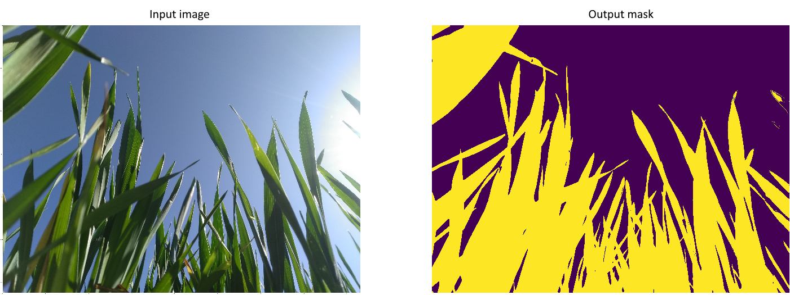
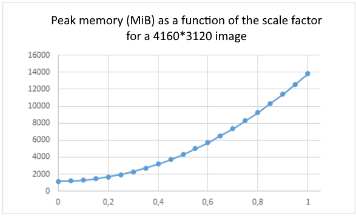

# grassUNet: *semantic segmentation for upward photos of plant canopy with PyTorch*



Custom implementation of the [U-Net](https://arxiv.org/abs/1505.04597) model for plant/sky semantic segmentation for upward photos taken from underneath plant canopy. Runs with Python 3.7.9 and PyTorch 1.7.1. This project is aimed to be used combinatory with the [CAN-EYE software](https://www6.paca.inrae.fr/can-eye) in order to compute biological variables such as Plant Area Index. It was supported by the R&D department of [SOWIT](https://www.sowit.fr/).

To train this model, a dataset of 2170 photos taken at a zenith angle of 57.5° was used. Photos were acquired with regular smartphones (Moto E4 Plus, Infinix X608, Huawei Mate 10 Lite) held with a custom apparatus at two different developmental stages (Zadoks Z30 and Z39) in three northern Morocco bread wheat plots sown with three different varieties during February and March 2020. The associated masks were semi-automatically generated with [CAN-EYE](https://www6.paca.inrae.fr/can-eye) and so, are noised. The dataset was splitted in 80% training, 10% validation and 10% test sets. Our training data were augmented with various transformations: brightness, contrast, gamma and saturation variations for the colorimetric ones, and horizontal flip, rotation and shearing for the geometrical ones. Photos resolution was 4K, but scaled by 0.125 for memory use.

The model was trained from scratch with 5208 images (1736 original images + data augmentation) on 5 epochs and scored a [dice coefficient](https://en.wikipedia.org/wiki/S%C3%B8rensen%E2%80%93Dice_coefficient) of 91.4% on 217 test images with semi-automatically generated masks, and 94.2% on 17 humanly-annotated images. The better result on the humanly-annotated tests could be explained by the better generalization of our model than one of the CAN-EYE semi-automatic segmentation step. Preliminary results indicate this segmentation model performs on bread wheat at least as well as the semi-automatic segmentation proposed by CAN-EYE.

The fails of our model are on the thin blades and, principally, on the specularities of some leaves. This score could be improved with more precisely-annotated data, more training, other data augmentation, fine tuning, playing with CRF post-processing, or using larger images to distinguish faint shades (more memory required). 

The project code is widely-based on the [milesial](https://github.com/milesial/Pytorch-UNet)'s one.


## Usage
**Note : Use Python 3.7 or newer**
### Prediction

After training your model and saving it to checkpoint/MODEL.pth, you can easily test the output masks on your images via the CLI.

To predict a single image and save it:

`python predict.py -i image.jpg -o output.jpg`

To predict a multiple images and show them without saving them:

`python predict.py -i image1.jpg image2.jpg --viz --no-save`

```shell script
> python predict.py -h
usage: predict.py [-h] [--model FILE] --input INPUT [INPUT ...]
                  [--output INPUT [INPUT ...]] [--viz] [--no-save]
                  [--no-thresholding] [--scale SCALE]

Predict masks from input images

optional arguments:
  -h, --help            show this help message and exit
  --model FILE, -m FILE
                        Specify the file in which the model is stored
                        (default: MODEL.pth)
  --input INPUT [INPUT ...], -i INPUT [INPUT ...]
                        filenames of input images (default: None)
  --output INPUT [INPUT ...], -o INPUT [INPUT ...]
                        Filenames of ouput images (default: None)
  --viz, -v             Visualize the images as they are processed (default:
                        False)
  --no-save, -n         Do not save the output masks (default: False)
  --no-thresholding, -t
                        Return the confidence masks (default: False)
  --scale SCALE, -s SCALE
                        Scale factor for the input images (default: 0.5)
```
You can specify which model file to use with `--model checkpoint/MODEL.pth`.

### Training

```shell script
> python train.py -h
usage: train.py [-h] [-d D] [-e E] [-b [B]] [-l [LR]] [-f LOAD] [-s SCALE]
                [-t]

Train the UNet on images and target masks

optional arguments:
  -h, --help            show this help message and exit
  -d D, --data D        Dataset directory path (default: data)
  -e E, --epochs E      Number of epochs (default: 5)
  -b [B], --batch-size [B]
                        Batch size (default: 1)
  -l [LR], --learning-rate [LR]
                        Learning rate (default: 0.0001)
  -f LOAD, --load LOAD  Load model from a .pth file (default: False)
  -s SCALE, --scale SCALE
                        Downscaling factor of the images (default: 0.5)
  -t, --human-test      Test with humanly-annotated data if True (default:
                        False)
```
By default, the `scale` is 0.5, so if you wish to obtain better results (but use more memory), set it to 1.

By default, the input images and target masks should be in the `data/train/img` & `data/train/mask` folders respectively for the training, `data/val/img` & `data/val/mask` for the validation, `data/test/img` & `data/test/mask` for the test with generated masks, and `data/test-hum/img` & `data/test-hum/mask` for the test with humanly-annotated data.

### Pretrained model
A pretrained model is available on the `checkpoint` folder for our own dataset. The training was done with a 0.125 scale on 4K images (so 520\*390 pixels) and using bilinear upsampling. Data augmentation (brightness, contrast, gamma, saturation, horizontal flip, rotation, shearing) were applied with a factor 3.

Currently, this model was only been tested on wheat photos taken at 57.5°. A remaining work is to test it with hemispherical photos and especially with other agricultural plants.

## Tensorboard
You can visualize in real time the train and test losses, the weights and gradients, along with the model predictions with tensorboard:

`tensorboard --logdir=runs`

## Notes on memory

The model has be trained from scratch on a NVIDIA T4 16GB.
Predicting images of 520\*390 takes approximatively 1.5GB of memory as shown on the below figure. This curve represents the theoretical peak memory during inference as a function of the scale factor for a 4160\*3120 image. It slightly underestimate the memory cost but it's a rather good approximation.



Training takes more, so if you are a few MB shy of memory, consider turning off all graphical displays.
This assumes you use bilinear up-sampling, and not transposed convolution in the model.

---

Code based on GitHub repository by Alexandre Milesi: [https://github.com/milesial/Pytorch-UNet](https://github.com/milesial/Pytorch-UNet) \
Original paper by Olaf Ronneberger, Philipp Fischer, Thomas Brox: [https://arxiv.org/abs/1505.04597](https://arxiv.org/abs/1505.04597)

